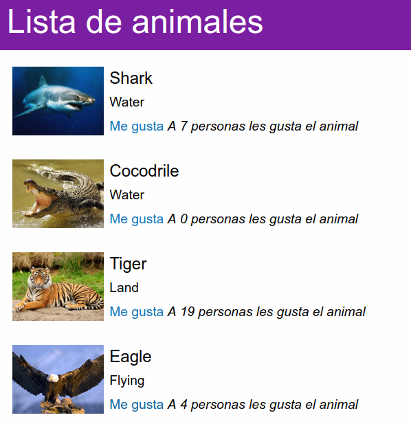
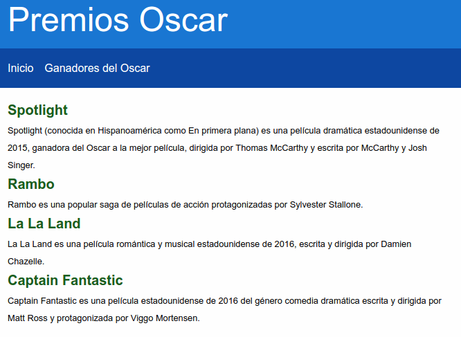

# react-examples

Serie de ejemplos para aprender [React](http://facebook.github.io/react) y [Redux](http://redux.js.org).

Entra al [espacio para prácticar](./play) para aprender.

La serie de ejemplos de [redux-examples](https://github.com/vulcan-estudios/redux-examples)
se recomenda tomar primero, debido a que en estos ejemplos se integra React con Redux.

## Levels

### Level 0: [Fundamentos](./level0)

### Level 1: [Aplicación sencilla](./level1)

### Level 2: [React - Redux](./level2)

### Level 3: [React Router](./level3)

## License

[MIT](./LICENSE)
